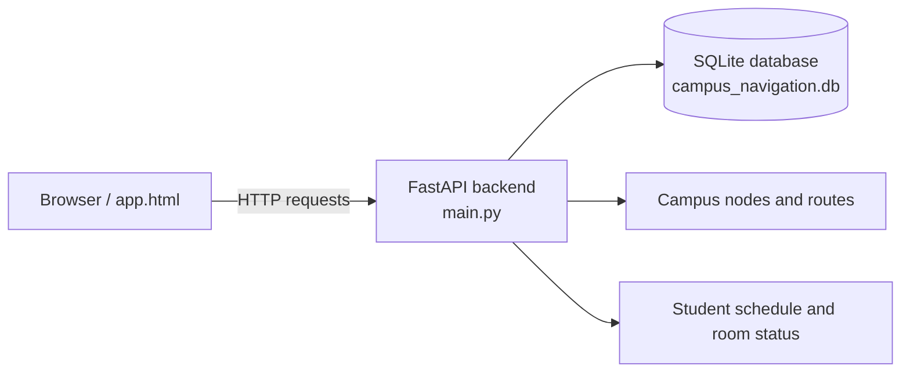

#Smart Campus Matrix

Smart Campus Matrix is a campus-navigation and room-status app built with a FastAPI backend, SQLite, and a mobile-style static frontend.

## Overview

The app combines three main pieces:

- live room status and timetable lookup from `campus_navigation.db`
- campus map and route planning endpoints for navigation
- student and admin account actions for registration, login, and overrides

The frontend lives in [app.html](app.html) and talks to the backend at `http://127.0.0.1:8000`.

## Architecture



## Features

- live room availability cards with timetable-aware status
- route planning over mapped campus nodes
- student profile registration and schedule lookup
- admin login and room override controls
- Leaflet-based campus map view in the browser

## Requirements

- Python 3.10 or newer
- `pip`

## Quick Start

From the repository root:

```powershell
git clone https://github.com/Franco3291/Hall-master.git
cd Hall-master
python -m venv .venv
.\.venv\Scripts\Activate.ps1
pip install -r requirements.txt
```

Initialize the local SQLite schema if needed:

```powershell
python database_setup.py
python create_students_table.py
```

If you want to refresh the campus node and edge data, run:

```powershell
python seed_campus_map.py
```

## Run The App

Start the backend from the project root:

```powershell
$env:ADMIN_PASSWORD='Campus@123'
uvicorn main:app --reload --host 127.0.0.1 --port 8000
```

Then open [app.html](app.html) in your browser.

## API Endpoints

- `GET /rooms/status`
- `GET /api/geo-nodes`
- `POST /students/register`
- `POST /students/login`
- `POST /admin/login`
- `GET /students/schedule/{reg_no}`
- `POST /verify`
- `POST /rooms/reset`
- `POST /navigate`

## Project Files

- [main.py](main.py) - FastAPI backend and API routes
- [app.html](app.html) - static frontend and map UI
- [campus_navigation.db](campus_navigation.db) - SQLite database used by the app
- [database_setup.py](database_setup.py) - creates required tables
- [seed_campus_map.py](seed_campus_map.py) - seeds nodes and edges

## Troubleshooting

- If you get `no such table: timetable`, run `python database_setup.py` from the repository root and restart the server.
- If the frontend cannot reach the backend, confirm the API is running on `http://127.0.0.1:8000`.
- `ADMIN_PASSWORD` defaults to `Campus@123` if you do not set an environment variable.

## Notes

- Run the commands from the repository root so the app opens the correct `campus_navigation.db` file.
- The frontend uses browser geolocation and Leaflet tiles, so it works best with internet access enabled.
